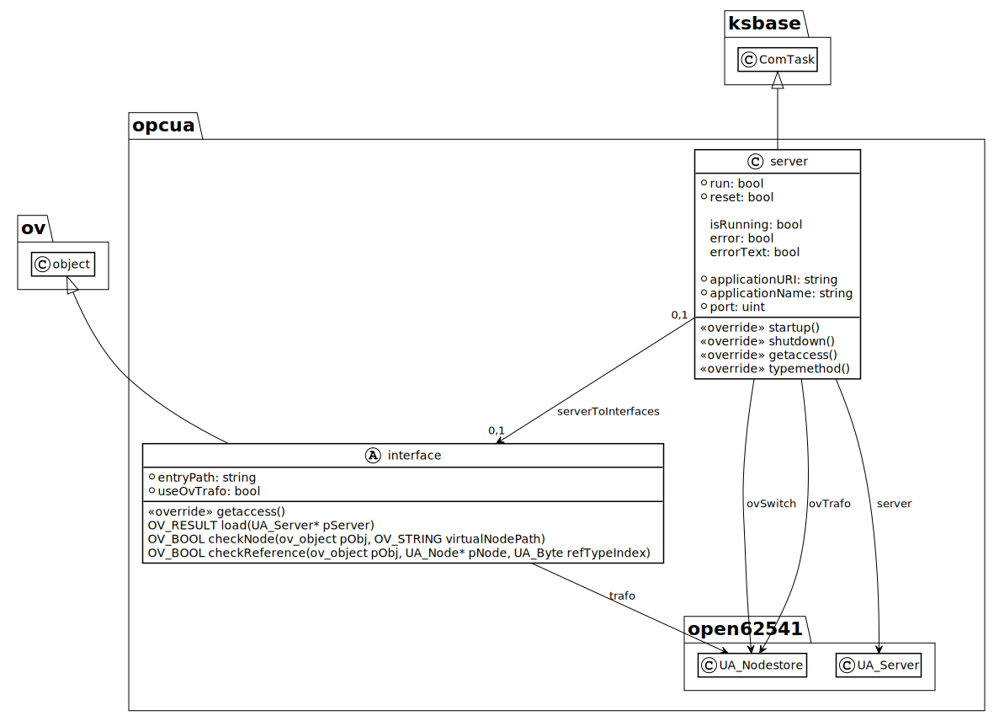

# OPC UA Server library (opcua)

This library provides the basic server functionalities for **OPC Unified Architecture** (OPC UA, IEC 62541).
It based on the [open62541](http://www.open62541.org/) stack, which is an open source implementation of the OPC UA stack, with server and client functionality in C.
The library supports a standard **OPC UA server** with an integrated **interface** to browse the ACPLT/OV object model, which is transformed to the OPC UA adress space model, in an ACPLT/RTE runtime environment.
Hence, the ACPLT/RTE can be viewed and manipulated from an OCP UA client.
An [example project](https://github.com/acplt/rte_opcua_example) with a ACPLT/RTE demo library shows how to extend the transformation by overwriting the `interface` class of this library to customize the OPC UA representation.

## Usage

To use the server functionality you have to:

* load the `opcua` library.
* create an object of the type `server`.
  * optionally configure the server object, e.g. port and application name.
  * optionally create `interface` objects and link them via `serverToInterfaces` association, c.f. [example project](https://github.com/acplt/rte_opcua_example)
* set `run` to true and check that `isRunning` changes to true.
* connect from an OPC UA client, e.g. [FreeOpcUa Client GUI](https://github.com/FreeOpcUa/opcua-client-gui) or [UaExpert](https://www.unified-automation.com/de/produkte/entwicklerwerkzeuge/uaexpert.html)

## Concept

The concept utilizes the so called **nodestore** as an inferface for all accesses to OPC UA nodes inside the server, which is implemented in open62541 as a [C structure with function callbacks](https://open62541.org/doc/current/nodestore.html#nodestore-plugin-api).
These accesses to nodes inside the server are triggered, when an OPC UA client calls OPC UA services, like browsing, reading or writing nodes.
The tranformation and nodestore concept was described in various publications, e.g.:

* INDIN 2020: **OPC UA Nodestore Switch - Usage Scenarios**, DOI: [10.1109/INDIN45582.2020.9442186](https://doi.org/10.1109/INDIN45582.2020.9442186)
* Automation 2020 (german): **OPC UA Nodestore Switch - Flexible Datenhaltung und Informationsmodellierung für OPC UA Server**, DOI:[10.51202/9783181023754-469](https://doi.org/10.51202/9783181023754-469)
* KommA 2016 (german): **Modelltransformation als Softwareadapter für OPC Unified Architecture**, [KommA Paper Archiv](https://www.jk-komma.de/index.php/paper-archiv)

The basic structure of source files and libraries with a simplified typical request is shown in the following figure:

Another view of the structure focussed on the nodestore switches is shown below:

## Library Content

As shown in the UML diagram above, the library comprises a `server`, an abstract `interface` class and the `serverToInterfaces` association:

* **Server** ([server.c](source/server.c)):
    special ks communication task, that creates, configures and runs the OPC UA server based on its settings.
    Multiple servers can be created, e.g. to allow for different security settings or transformations. Make sure to use different ports, when using multiple OPC UA servers in one runtime environment.
  * **Namespace Switch** ([nsSwitch.c](source/nsSwitch.c)):
    Replaces the standard nodestore of the open62541 OPC UA server with a switch that chooses configurable nodestores based on the namespace index of the OPC UA node to access.
  * **OV Switch** ([ovSwitch.c](source/ovSwitch.c)):
    Replaces the nodestore for namespace 1 (application namespace) in the nsSwitch by a switch that decides between a generic transformation (ovTrafo), the `trafo` of a linked interface or no access (NULL/ErrorCode).
  * **OV Trafo** ([ovTrafo.c](source/ovTrafo.c)):
    A nodestore, that creates OPC UA nodes from the ACPLT/OV objects (respectively elements or even virtual objects) requested via the string identifier of nodeIds, to allow for an unidirectional transformation (plus writing of values).
  * **Helpers** ([helpers.c](source/helpers.c)):
    Helpful functions, that are used in multiple source files or that are usefull for custom transformations.
* **Interface** ([interface.c](source/interface.c)):
  * **Server to Interfaces** ([serverToInterfaces.c](source/interface.c)):
    Used to link a server to a custom interface that is derived from the abstract interface class.

## Features / Remarks

TODO: What features are missing, what is not fully implemented? E.g. security (anonymous, user/pass, certificates)
TODO: Generic Trafo is unidirectional (OV-->UA)

# Compilation Hints

TODO: Remarks on used version (v1.2.3) and submodule
TODO: Remarks on setting necessary open62541 defines, e.g. NS0 and IMMUTABLE_NODES, ...